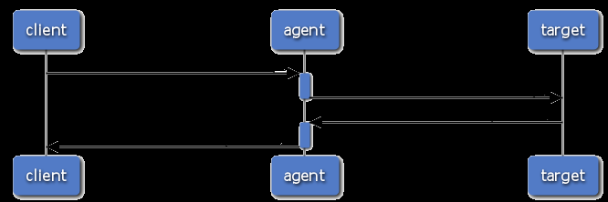
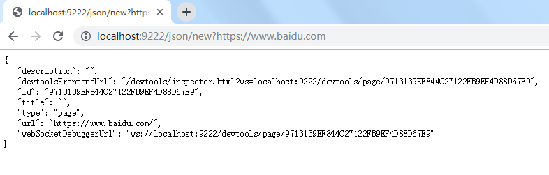
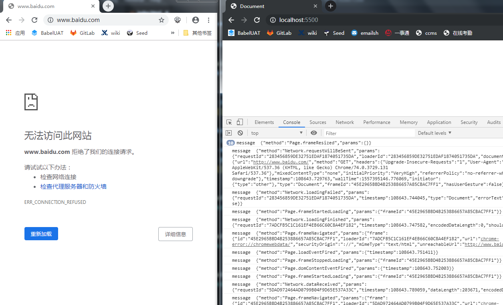
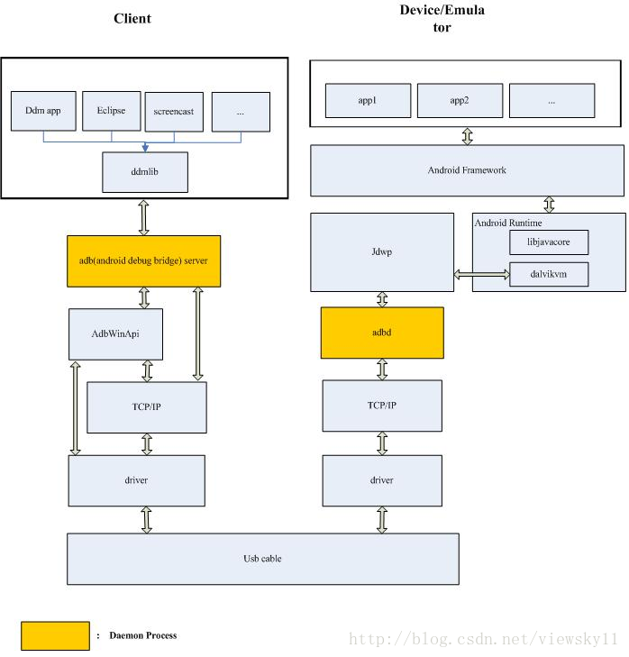
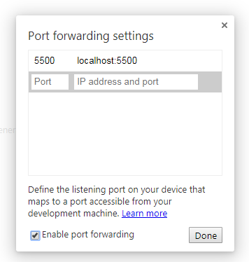

# chrome 远程调试解析

---

2019/05/10

---

> 本地调试，即在网页中直接按 `F12` 打开调试面板的方法，可以直接加断点调试。

> 在移动端，并没有调试面板，可以用电脑上的调试工具来调试么？

> 如果两者网络环境隔离，可以通过其他方式来调试么？

## 1. 调试方式比较

- `alert`

  这种方法最简单，在代码可能出现问题的地方直接添加 `alert`，然后再通过手机去浏览。

  **缺点是污染源代码，调试比较困难**

- `console`

  配合 [`vconsole`](https://github.com/Tencent/vConsole)，[`eruda`](https://github.com/liriliri/eruda)，原理是用自定义 `console` 将 `windows.console` 覆盖掉，可以输出调试内容到一个浮层中。还可以查看 `Navigation Timing API`，`PerformanceResourceTiming` 等等信息。

  **缺点是需要插入一段自定义 `js`，线上版本不能插入，也不能断点调试，只能一步步看 console**

- `Weinre`

  > https://segmentfault.com/a/1190000010017457
  >
  > 目标页面（target）：被调试的页面，页面已嵌入 `weinre` 的远程 `js`
  > Debug客户端（client）：本地的Web Inspector调试客户端
  > Debug服务端（agent）：一个HTTP Server，为目标页面与Debug客户端建立通信（target和client不断的向agent发生get/post请求）

  通过电脑端来调试手机端

  

  **缺点是没有和浏览器内核结合，能做的和上面的 `vconsole` 差不多，只是在电脑端访问，没有断点调试**

## 2. `ChromeDevTools`

在 `chrome` 中，调试工具是一个独立的程序，叫做 [`chromeDevTools`](https://developers.google.com/web/tools/chrome-devtools/)（以下称 `DevTools`）。通过 `F12` 打开，看到的是它的前端界面，一个 `html` 搭建的 `web` 应用。浏览器内核会给它传递很多信息，如缓存状况、JavaScript 方法执行情况等，它也可以通知浏览器内核添加断点。它包含丰富的功能，扩展性强，利用它的数据，可以方便地[扩展功能](https://developer.chrome.com/devtools/docs/integrating)。

`DevTools` 还支持远程调试，即使不在同一个 `chrome` 中，只要遵循调试信息发送的规则，`DevTools` 就可以正确展示网页信息和调试网页。这个规则，就是 [`Webkit Debug Protocol`](https://chromedevtools.github.io/devtools-protocol/)，通过 `websocket`（以下称 `ws`） 进行传递。

## 3. 本地体验远程调试

在本地，我们也可以体验一下远程调试，**注意打开之前关闭所有 `chrome` 页面**。

```bash
# windows 中，设置 chrome 的快捷方式，或者直接命令行启动
"C:\Program Files (x86)\Google\Chrome\Application\chrome.exe" --remote-debugging-port=9222

# mac 中
sudo /Applications/Google\ Chrome.app/Contents/MacOS/Google\ Chrome --remote-debugging-port=9222
```

上面添加的参数， `chrome` 会创建一个`server`，里面运行了 `Devtools` 的前端界面。打开 `http://localhost:9222` 就可以看到一些打开的网页，点进去就是一个独立的 `DevTools`。

> https://chromedevtools.github.io/devtools-protocol/
>
> - When you navigate your *client* browser to the remote's Chrome port, Developer Tools front-end is being served from the *host* Chrome as a Web Application from the Web Server.
> - It fetches HTML, JavaScript and CSS files over HTTP
> - Once loaded, Developer Tools establishes a Web Socket connection to its host and starts exchanging JSON messages with it.
>

如链接：

`http://localhost:9222/devtools/inspector.html?ws=localhost:9222/devtools/page/1A8C0682E0FC7CDDAB8F9BD5066088BE`

可以看到访问的是 `http://localhost:9222/devtools/inspector.html` 这个页面，这就是用来展示接收到浏览器数据的前端页面，`querystring` 代表了它连接的 `ws` 地址，通过这个链接来和真正执行的浏览器内核进行通讯。

更详细的信息可以在 `http://localhost:9222/json` 中查看，其中 `webSocketDebuggerUrl` 就代表调试用的 `ws` 地址。还可以进行以下操作：

- `list` 列举所以标签页

- `new` 新标签页

- `close` 关闭标签页

- `activate` 激活标签页

- `version` 显示版本

- `protocol` 当前的 `devtools protocol`

- `/devtools/page/{targetId}` 调试用 `ws` 链接的一个端口，调试信息会推送到这个端口

如 `http://localhost:9222/json/new` 会打开一个新的页面，并展示当前的页面信息。



## 4. `Webkit Debug Protocol`

那么它们传递的信息到底长什么样子呢？

在浏览器里，我们可以开启 `chrome://flags/#*enable*-*devtools*-*experiments*`，接着重启，在 `DevTools` 的 `setting` 中，``experiments` 菜单里打开 `Protocol monitor` 显示，然后再重启，在 `DevTools` 菜单的 `More Tools` 就可以看到 `Protocol Monitor` 的选项了。


但是这并不是原本的 `ws` 协议，这是被转换后的协议，我们可以手动监听 `ws`，看看具体是怎么写的。

### 4.1 监听 `ws`

我们建立与某个 `webSocketDebuggerUrl`，即可收到它发送的消息

如果使用 `node` 监听，可参考 [taobaofed](http://taobaofed.org/blog/2015/11/20/webkit-remote-debug-test/) 实现，这里直接用网页实现，不需要其他库

```html
<script>
    // 在 http://localhost:9222/json/ 中找到的一个 webSocketDebuggerUrl
    const socket = new WebSocket('ws://localhost:9222/devtools/page/xxx');

    socket.addEventListener('open', function (event) {
        socket.send(JSON.stringify({
            id: 1,
            method: 'Network.enable',
            params: {}
        }),{});
    });

    socket.addEventListener('message', function (event) {
        console.log('message ', event.data);
    });

    socket.addEventListener('close', function (event) {
        console.log('close');
    });

    socket.addEventListener('error', function (event) {
        console.log('error ', event.data);
    });
</script>
```

放到一个 `server` 中，如（`nginx`），然后对调试页面做缩放，刷新等操作，就可以收到数据了

如下图：左边为调试目标页，右边为上面代码页面



可以看到，数据交流格式都是 `json` 形式，有 `method` 与 `params` 参数，具体格式可参考协议内容。

## 5. `chrome android` 调试

`DevTools` 通过 `ws` 与 浏览器内核传输 `Webkit Debug Protocol` 协议，这样只要 `pc` 和 真机在网络上能互相访问，就能实现 `DevTools` 与运行浏览器部署在两端

### 5.1 权限管理

> http://taobaofed.org/blog/2016/10/19/chrome-remote-debugging-technics/#权限管理
>
> Google 为了限制调试端口的接入范围，对于 Chrome PC 浏览器，调试端口只接受来自 `127.0.0.1` 或者 `localhost` 的数据请求，所以，你无法通过你的本地机器 `IP` 来调试 Chrome。对于 `Android Chrome/WebView`，调试端口只接受来自于 `shell` 这个用户数据请求，也就是说只能通过 `USB` 进行调试，而不能通过 `WIFI`。

### 5.2 实现方法

#### 5.2.1 新版 `chrome` 

已经实现了 `android` 打开 `usb调试` 后，记住传输模式要选择文件传输，因为两端通过 `USB` 来通信，接收电脑端的公钥。

因为需要 `chrome` 内部的 `adb` 参与工作，可能会提示安装驱动，可以在附件列表中找到，参考[安装ADB Interface](https://www.cnblogs.com/arxive/p/6764279.html)，只需要安装 `ADB Interface` 即可，不需要 `adb`，安装不了还需要自行下载对应驱动。

就可以直接在 `chrome://inspect` 页面中找到对应的 `android chrome` 页面，然后 `inspect` 它。

对于其他应用中的 `webview`，需要开启调试：

> https://github.com/CN-Chrome-DevTools/CN-Chrome-DevTools/blob/master/md/Use-Tools/remote-debugging.md
>
> 必须要在你应用中设置才可以启用 `WebView` 的调试。你可以调用一个 `WebView` 类的静态方法 [setWebContentsDebuggingEnabled](http://developer.android.com/reference/android/webkit/WebView.html#setWebContentsDebuggingEnabled)。
>
> ```
>   if (Build.VERSION.SDK_INT >= Build.VERSION_CODES.KITKAT) {
>       WebView.setWebContentsDebuggingEnabled(true);
>   }
> ```
>
> 这样就在应用里面所有的 `WebViews` 中启用调试。

#### 5.2.2 旧版 `chrome`（`ver. < 32`）

实现方式更为复杂一点，新版 `chrome` 简化了这个流程

`chrome PC` 通过 `adb (android debug bridge)` 来和 `android chrome` 互联，传递指令消息和 `ws`等

> 原理部分： https://developer.android.com/studio/command-line/adb
>
> `adb` 分为三个部分
>
> - client：运行在 PC 端，用于发送指令
> - adbd：运行在 android 端，一个后台程序，用于在 android 端执行指令
> - server：运行在 PC 端，用于在 client 与 adbd 之间传递信息
>
> 当 adb 运行时，即输入 adb 开头的指令，client 就会检测本地是否开启了 server，没有就开启一个 server，并监听 TCP 5037 端口，接收 client 的指令。
>
> USB 连接 android 设备，开启 USB 调试，会自动挂载到 PC 上，如果驱动安装失败，则挂载失败。
>
> server 会自动去寻找挂载成功的设备，并且尝试建立连接

操作方法：

1. 打开手机端 `USB` 调试。

2. 将附件列表中的 `adb` 程序按安装说明装好，参考[安装ADB Interface](https://www.cnblogs.com/arxive/p/6764279.html)

3. 启动命令行工具

   1. 输入 `adb devices`，确认 `adb server` 已经发现了这些设备

      - 这一步可能出现无法创建 `server` 的报错，可以将几个文件复制到 `windows/SysWOW64` 中，参考[使用adb命令连接模拟器](https://blog.csdn.net/xishuluoye/article/details/17880663)

      - 如果无法发现连接设备，并且驱动已经装好，可以在个人文件夹的 `.android` 文件夹中创建 `adb_usb.ini`，手动输入设备 id，参考 [adb devices List of devices attached 为空](https://blog.csdn.net/join_12/article/details/45970717)

   2. 输入 `adb forward tcp:9222 localabstract:chrome_devtools_remote`，即可将 `PC` 端 `9222` 与android 端 `chrome_devtools_remote` 这个 `domain socket` 建立了一个端口映射。

可以用一张图来表示，它们之间的关系，右侧为手机端：



## 6. `iOS safari` 调试

实际上，基于 `webkit` 内核的 `iOS` 设备也可以用 `DevTools` 来调试 `webview`。

> http://taobaofed.org/blog/2015/11/27/webkit-remote-debug-action/
>
> `iOS` 的 `Safari` 远程调试，是 `iOS7` 引入的新功能。它允许开发者通过桌面端 `Safari` 的调试工具远程检视移动端浏览器打开的页面。这套调试工具，彻底解决了无线开发纯靠 `alert` 的调试困境。`Safari` 的远程调试中使用到的调试协议，与 `Google` 开放的 [Chrome Debug Protocol](https://developer.chrome.com/devtools/docs/debugger-protocol) 有牵丝万缕的关系，体现了这两家互联网巨头相爱相杀的本质：
>
> 1. 这两套协议本质都是 `Webkit Debug Protocol` 的衍生产物。大部分的实际功能是一模一样的，例如 DOM 检视、网络请求监控、Console 等。
> 2. 自从 `Google` 与 `Webkit` 项目撇清关系，分道扬镳后生下亲儿子 `blink` 后，自己的调试功能越来越强大，并逐渐产生了一些和 `Webkit` 调试协议不一样的功能，故自成一套 `Chrome Debug Protocol`。
> 3. `Apple Safari` 这个养在深闺里小女子，虽然主导 `Webkit`，但是在实际产品使用中，却并没有直接使用 `Webkit Debug Protocol`，不仅仅使用了 [binary plist](https://developer.apple.com/library/mac/documentation/Darwin/Reference/ManPages/man5/plist.5.html) 来作为序列化方法，还抛弃了 `WebSocket` 的通讯手段。没有文档、没有代码，我们姑且叫这个不舍得露面的东西叫做 Safari 调试协议吧。

可以理解 `iOS` 的调试协议就是基于 `Chrome Debug Protocol` 的，而 `iOS` 中也有类似 `adbd` 的 `lockdown` 服务，可以连接到 `safari` 的调试进程。具体原理可以看上面引用参考，这里不做赘述。

我们不用实现那么麻烦的协议转换，`Google` 开源了工具 [ios-webkit-debug-proxy](https://github.com/google/ios-webkit-debug-proxy)，可以简化联调手段，参考自 [Safari 前端开发调试 iOS 完美解决方案（iPhone/iTouch 等）](https://chon.io/blog/safari-ios-iphone-itouch-web-dev-inspector)

- 打开手机上的 `设置` - `Safari` - `高级` - `web 检查器`
- 连接电脑 `USB`，信任电脑
- 打开 `chrome`，输入 `http://localhost:9222`，将网址复制出来到新页面展示

因为 `chrome` 的升级，新版 `DevTools` 并不兼容 `Safari` 了，可以使用 [RemoteDebug/remotedebug-ios-webkit-adapter](https://github.com/RemoteDebug/remotedebug-ios-webkit-adapter) 这个插件代替，但是安装太麻烦了。

## 7. `Port Fowarding`

`chrome` 还支持手机浏览器通过 `USB` 线访问 `PC` 端网站，[原理](https://developers.google.com/web/tools/chrome-devtools/remote-debugging/local-server) 如下：

>  在 `android` 中创建一个 `TCP` 监听端口，与 `PC` 端一个端口通过 `USB` 进行映射，这样访问这个监听端口时，实际上访问的是 `PC` 端的映射端口。

设置方法：

- 打开 `chrome://inspect`，点击 `Port fowarding`
- 里面每一行都是一个映射关系，左侧填 `android` 监听端口，右边填 `PC` 机的访问地址，如 `localhost:5500`，勾选下面的启用



然后连接手机，就可以访问这个地址了，因为是在 `android` 端起了一个服务器，也可以用其他浏览器访问这个地址

## 8. 线上调试

知道了 `DevTools` 的调试原理，其实就是和浏览器内核进行通讯，那么我们也就可以将调试工具的信息放到公网，实现线上调试。

**不负责猜想 :)**

- 尝试自定义 `android chrome`，修改其中有关本地限制的代码
- 将 `PC` 端用于调试的接口，映射到其他某个公网端口，如 [ssh -l](https://www.ibm.com/developerworks/cn/linux/l-cn-sshforward/)（推荐阅读，端口转发），这样就能公网实时访问，用对应机型调试网页

### 参考

- [Chrome 远程调试协议不完全指南](https://syang2forever.github.io/2018/01/30/Chrome%20%E8%BF%9C%E7%A8%8B%E8%B0%83%E8%AF%95%E5%8D%8F%E8%AE%AE%E4%B8%8D%E5%AE%8C%E5%85%A8%E6%8C%87%E5%8D%97/)
- [揭秘浏览器远程调试技术](http://taobaofed.org/blog/2016/10/19/chrome-remote-debugging-technics/)
- [Webkit远程调试协议实战](http://taobaofed.org/blog/2015/11/27/webkit-remote-debug-action/)
- [使用 Chrome 远程调试 Android 设备](https://github.com/CN-Chrome-DevTools/CN-Chrome-DevTools/blob/master/md/Use-Tools/remote-debugging.md)
- [Remote Debuging on Android(Legacy Workflow)](https://developer.chrome.com/devtools/docs/remote-debugging-legacy)
- [Android Debug Bridge (adb)](https://developer.android.com/studio/command-line/adb)
- [adb forward的细节（1）：原理概述](https://blog.csdn.net/u013553529/article/details/80036227)
- [adb和adbd分析](https://blog.csdn.net/viewsky11/article/details/53889143)
- [ios和Android的远程调试(Remote Debugging)](https://blog.csdn.net/hqzxsc2006/article/details/50730604)
- [使用Chrome DevTool调试iOS设备的webView](https://www.jianshu.com/p/19c18c924f91)
- [Unix domain socket 简介](https://www.cnblogs.com/sparkdev/p/8359028.html)

附件：

- [ADB_Interface安装与配置.rar](./ADB_Interface安装与配置.rar)